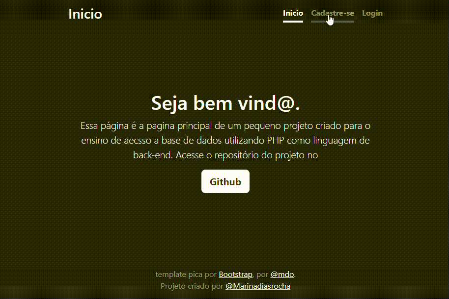

# Índice

[Aplicação](https://github.com/MarshyyUWU/aplica-oDeCadastroLogin?tab=readme-ov-file#-aplica%C3%A7%C3%A3o-na-p%C3%A1gina)  
[Descrição](https://github.com/MarshyyUWU/aplica-oDeCadastroLogin?tab=readme-ov-file#%EF%B8%8Fdescri%C3%A7%C3%A3o)
[Linguagens-Utilizadas](https://github.com/MarshyyUWU/aplica-oDeCadastroLogin?tab=readme-ov-file#-linguagems-usadas)
[Fontes-Consultadas](https://github.com/MarshyyUWU/aplica-oDeCadastroLogin?tab=readme-ov-file#fontes-consultadas)
[Autores](https://github.com/MarshyyUWU/aplica-oDeCadastroLogin?tab=readme-ov-file#autores)

# 💕 Aplicação na página

## ❤️Descrição
Uma pagina usando php e bootstrap, com as informações tiradas do gif do teams do professor Leonardo.
- Com ajuda da Julia Oliveira

### 💖 Linguagems usadas
- Css
- Html
- Bootstrap
- xamp
#### VS CODE
- Version: 1.71.0 (system setup)
- Commit: 784b0177c56c607789f9638da7b6bf3230d47a8c
- Date: 2022-09-01T07:36:10.600Z
- Electron: 19.0.12
- Chromium: 102.0.5005.167
- Node.js: 16.14.2
- V8: 10.2.154.15-electron.0
- OS: Windows_NT x64 10.0.22621
- Sandboxed: No
## 🥰Fontes consultadas

* [Alura](https://www.alura.com.br/artigos/escrever-bom-readme) - Como escrever um README incrível
* [Github](https://gist.github.com/lohhans/f8da0b147550df3f96914d3797e9fb89) - Um modelo para fazer um bom README.md
* [Boostrap](https://getbootstrap.com/) - Pagina inicial do Boostrap

## 😍Autores
* [Marsh](https://github.com/MarshyyUWU)

